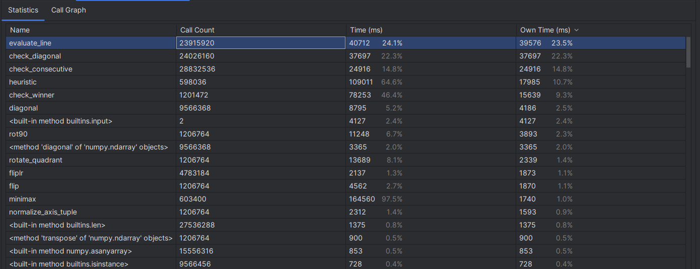

# Pentago - Zhen Li

## Project Type: Developing an AI game player for an original variation of the Pentago game

## Pentago Introduction:

Pentago is an abstract strategy game for two players with four 3×3 grids arranged into a larger 6×6 grid. This game reimplements the well-known Connect 4 with a twist: After placing a marble, the player has the option to twist one of the grids by 90°, thus changing the board after every turn. The first player to get five marbles in a row wins.

## Game Variation:

The variation I built upon the original Pentago is changing the board to four 4×4 grids arranged into a larger 8×8 grid, meanwhile, the winning condition changes to SIX marbles in a row. This larger layout enables players a larger space to play against each other and thinking of strategy. Compared to original smaller board, it's less likely to achieve a draw.

## AI Player Implementation:

The AI player is implemented based on Minimax algorithm and alpha-beta pruning.

## How to Start Game:

Execute the ```play_game.py``` file, follow the text prompt to choose whether play 6X6 or 8X8 board size. Then choose the game mode either play computer-vs-computer and/or against human players. When you play as a human player, input the move you want in this format: ```row, col, quadrant, direction```. ```row``` and ```col``` index is labeled in the printed text board. For ```quadrant```,  the top-left quadrant is number 0, top-right quadrant is number 1, bottom-left quadrant is number 2, and bottom-right quadrant is number 3. For ```direction```, 1 means rotate clockwise, -1 means rotate counterclockwise. For example, if you input ```1, 2, 1, -1```, your move is placing a piece on the cell of row 1 column 2 and then rotate the quadrant on top-right counterclockwise.

## Target Algorithm Analysis:

```evaluate_line()``` and ```heuristic()``` functions are used to calculate the evaluation score of a board instance. 

The ```evaluate_line()``` uses sliding window to calculate a single line's score. The initial window size equals to the length of achieving a win, for example, five in a 6X6 board. Each time of sliding the window, the first item is removed and a new item is appended. To initiate the window, the time is _O(win_length)_. Each time slide the window, the time is _O(1)_, let _n_ be the length of the board, window needs to be slided (n-win_length) times. So the overall time complexity of ```evaluate_line()``` is _O(n)_, n is the board length.

The ```heuristic()``` functions calls ```evaluate_line()``` multiple times to evaluate the entire board. For a board with size _n x n_, the number of diagonals to check is _4*(n-win_length)+2_, since other shorter diagonals will never occur consecutive pieces to achieve win. For each column, each line, each diagonal, the ```evaluate_line()``` is called once, the total call time is _2n+4*(n-win_length)+2_. Multiply with the time complexity of ```evaluate_line()```, the overall estimated time complexity of ```heuristic``` will be _O(n^2)_, n is the board length.

The function to find all empty cells is the ```get_empty_positions()``` in ```Pentago``` class. The time complexity is _O(n)_, n is the total number of cells on board. I was intended to use a variable to store all empty cells and update this variable during play, but rotating quadrant will change index of cells, it's kind dirty to handle this.

## Performance Measurement:

**Starting the game in 6X6 mode and choose the AI player vs AI player**

We can see that at the early stage of the game, the decision time used by AI player is pretty slow. As more pieces are placed on the board, the decision time becomes faster. Since when there are less empty cells, the AI needs to do less simulation movement. 

The profiler pictures for a 6X6 AI vs AI player shows below :



The overall time for this game from start to end is about 3 minutes. We can see that the most time-consuming function is ```evaluate_line()```. However, ```check_consecutive()``` and ```check_diagonal()``` also spend pretty much of time. Those two functions are called by ```check_winner()``` to scan the whole board to determine if there's a winner or not. It's possible to explore some improvement of efficiency for ```check_diagonal()```.

**Starting the game in 8X8 mode and choose the AI player vs AI player**

The AI player makes move extremely slow at the early stage, since the time complexity mentioned earlier is about _O(n^2)_, n is the board length. The increase of board size makes the time complexity of heuristic function grow exponentially. 